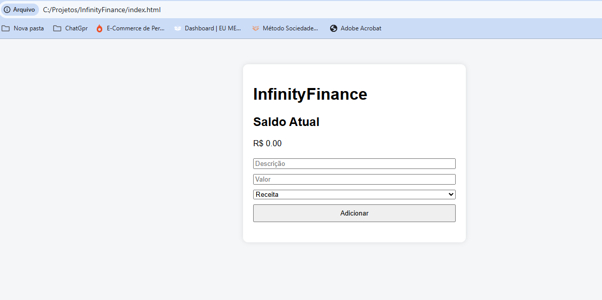

# 💰 InfinityFinance — Controle Financeiro Pessoal

Aplicação web para controlar **receitas e despesas**, com **saldo automático**, **totais por tipo** e **persistência no navegador** via LocalStorage.

🔗 **Demo online:** https://angelomarquess.github.io/InfinityFinance/  
📦 **Repositório:** https://github.com/AngeloMarquess/InfinityFinance

---

## ✅ Funcionalidades
- ➕ Adicionar receitas e despesas
- 🧾 Listar transações
- 🧮 Cálculo automático de saldo
- 📊 Totais de **receitas** e **despesas**
- 🗑️ Remover transações
- 💾 Persistência com **LocalStorage**

---

## 🖼️ Preview


---

## 🛠️ Tecnologias
- HTML5
- CSS3
- JavaScript (Vanilla)

---

## ▶️ Como rodar o projeto localmente

### Opção 1 — Abrindo direto no navegador
1. Clone o repositório:
```bash
git clone git@github.com:AngeloMarquess/InfinityFinance.git

## 📄 Licença

Este projeto está sob a licença MIT. Veja o arquivo LICENSE para mais detalhes.

